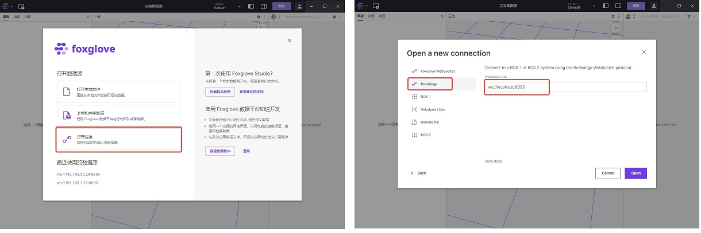
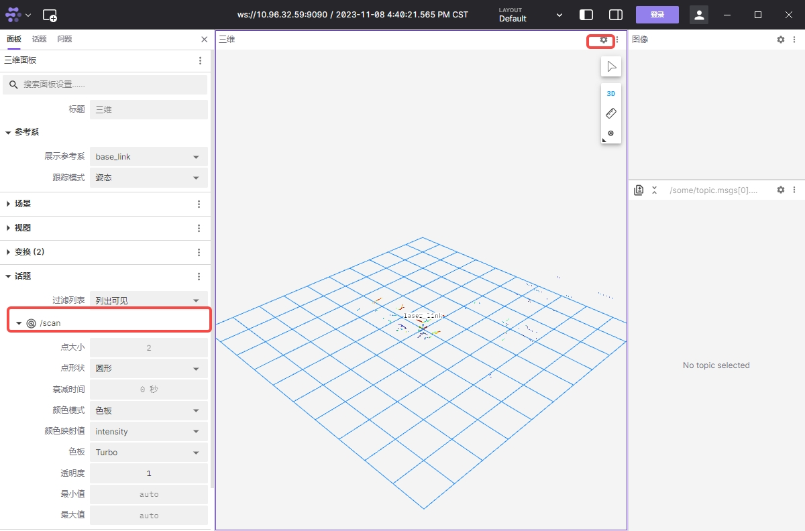
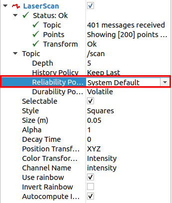
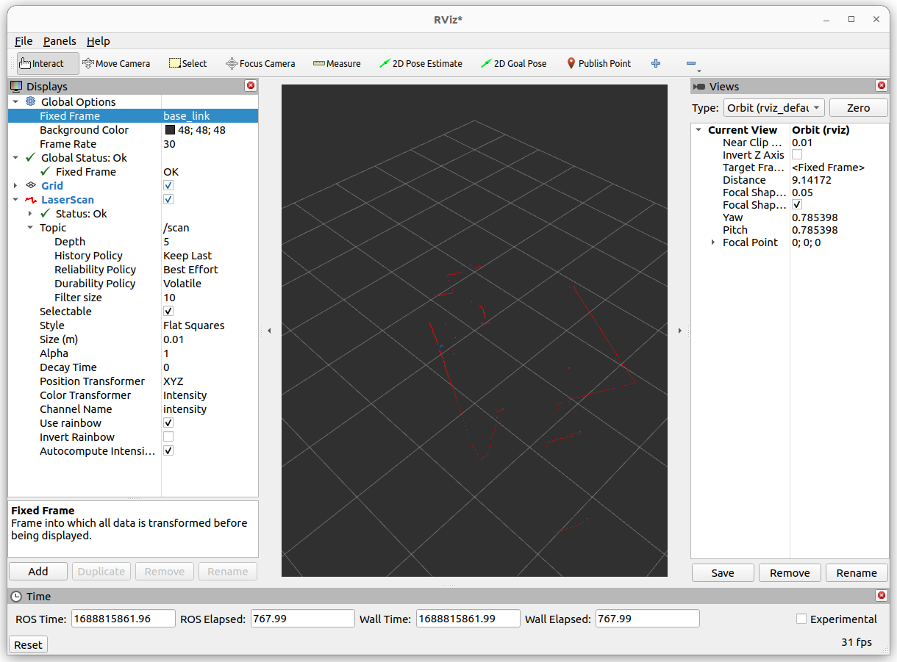

# 功能介绍

SLLIDAR ROS2驱动，以ROS2标准消息格式发送激光雷达数据。

# 物品清单

完善的产品型号请以[lslidar官网](https://www.slamtec.com/) SLLIDAR X3为例进行演示。


| 物料选项    | 清单      | 
| ------- | ------------ | 
| RDK X3  | [购买链接](https://developer.horizon.ai/sunrise) | 
| SLLIDAR X3 | [购买链接](https://www.slamtec.com/cn/Lidar/A1) | 

# 使用方法

## 准备工作

1. 地平线RDK已烧录好地平线提供的Ubuntu 20.04系统镜像。

2. SLLIDAR正确链接RDK X3

## 安装SLLIDAR驱动

通过终端或者VNC连接RDK X3，执行以下命令

```bash
sudo apt update
sudo apt install -y tros-sllidar_ros2
```
**注意：如果安装时SLLIDAR已连接在RDK X3上，则安装完后需要重新拔插一次**

## 运行SLLIDAR

```bash
source /opt/tros/setup.bash
ros2 launch sllidar_ros2 sllidar_a1_launch.py
```

## 查看雷达数据

### 方式1 命令行方式

新打开一个终端，在里面输入以下命令查看激光雷达输出数据

```bash
source /opt/tros/setup.bash
ros2 topic echo /scan
```
### 方式2 使用foxglove可视化

***注意：运行Foxglove Studio的设备应与RDK设备处于同一网段***

1. 前往foxglove[官网下载](https://foxglove.dev/download)Foxglove Studio,并在PC上进行安装

2. 新打开一个RDK终端并输入以下命令安装rosbridge

```bash
sudo apt install ros-foxy-rosbridge-suite
```

3. 运行以下命令启动rosbridge

```bash
source /opt/tros/setup.bash
ros2 launch rosbridge_server rosbridge_websocket_launch.xml
```
4. 打开Foxglove Studio，选择“打开连接”，在接下来的对话框中选择rosbridge连接方式，并填入RDK的ip地址取代localhost



5. 在foxglove studio中点击右上角的“设置”按钮，在左侧弹出的面板中将雷达话题配置“可见”，此时studio中讲实时显示雷达点图



### 方式3 RVIZ方式

在PC或者支持RVIZ的环境下安装ROS2，这里以foxy版本为例，运行

```bash
source /opt/ros/foxy/setup.bash
ros2 run rviz2 rviz2
```

添加LaserScan，配置Reliability Policy为System Default



设置Fixed Frame为base_link或者laser_link即可看到激光雷达采集数据




# 接口说明

## 话题

### 发布话题
| Topic                | Type                    | Description                                      |
|----------------------|-------------------------|--------------------------------------------------|
| `scan`               | sensor_msgs/LaserScan   | 二维激光雷达扫描数据                |


## 参数
| Parameter name | Data Type | detail                                                       |
| -------------- | ------- | ------------------------------------------------------------ |
| frame_id     | string | frame名称默认值: `laser_frame` |
| tcp_ip     | string | TCP ip地址`192.168.0.7`|
| tcp_port     | int | TCP 端口号 <br/>默认值: `20108` |
| udp_ip   | string | UDP ip地址`192.168.11.2`|
| udp_port     | int | UDP 端口号 <br/>默认值: `8089` |
| difop_port     | int | 雷达源端口号 <br/>默认值: `2369` |
| channel_type     | string | 接口选择:`udp` 网络UDP,`tcp` 网络TCP,`serial` 为串口. <br/>默认值: `serial` |
| serial_port     | string | 设置激光雷达设备端口号<br/>例如串口 `/dev/ttyUSB0` |
| serial_baudrate     | int | 串口波特率 <br/>默认值: `1000000` |
| inverted  | bool | M10_P雷达需填写`false`,若不确定，请联系技术支持 |
| angle_compensate  | bool | 是否使用角度补偿功能.<br/>默认值:`false` |
| pubScan  | bool | 是否发布scan话题.<br/>默认值:`true` |
| scan_mode     | string | 设置激光数据的扫描模式: `` |
| scan_frequency     | float | 雷达的扫描速度.<br/>默认值: `10.0` |

